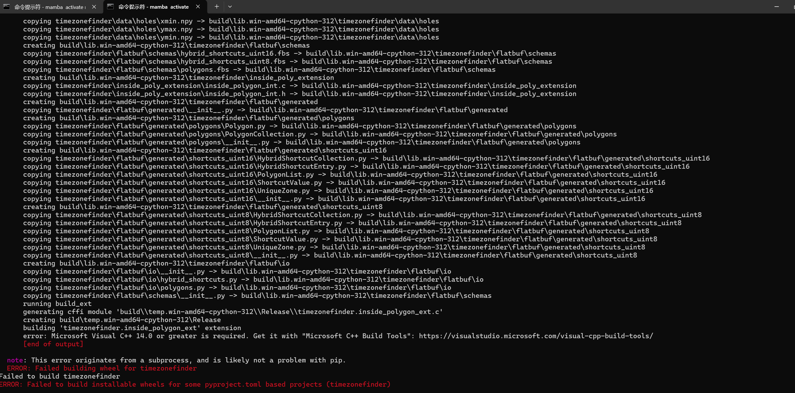

# 扩展4：如何安装 MSVC 编译器

## 为什么需要 MSVC 编译器？

### Python 包的两种分发形式

在理解为什么需要 MSVC 之前，我们需要了解 Python 包的两种主要分发形式：

#### 1. 源代码包 (Source Distribution, sdist)
- **文件格式**：`.tar.gz` 或 `.zip`
- **内容**：包含原始的 Python 和 C/C++ 源代码
- **安装过程**：需要在用户机器上**本地编译** C/C++ 代码
- **优点**：体积小，可以针对特定平台优化
- **缺点**：需要编译器和依赖库，安装速度慢，容易出错

#### 2. 预编译二进制包 (Wheel, .whl)
- **文件格式**：`.whl`（本质上是 zip 文件）
- **内容**：已经编译好的二进制文件和 Python 代码
- **安装过程**：直接解压安装，**无需编译**
- **优点**：安装快速，无需编译器
- **缺点**：需要为不同平台/Python 版本提供不同的 wheel

### 实例对比：timezonefinder 包的安装

让我们以 `timezonefinder` 包为例，看看不同安装方式的区别：

#### 使用 pip 安装（无 MSVC）

```cmd
pip install timezonefinder
```

**可能遇到的问题：**
```
Building wheel for timezonefinder (setup.py) ... error
error: Microsoft Visual C++ 14.0 or greater is required.
Get it with "Microsoft C++ Build Tools"
```

**失败原因分析：**
1. pip 从 PyPI 下载包
2. 如果没有适合当前环境的预编译 wheel，pip 会尝试下载源码包（sdist）
3. timezonefinder 包含 C/C++ 扩展代码（用于加速地理计算）
4. 编译这些 C/C++ 代码需要 MSVC 编译器
5. Windows 系统默认没有 MSVC，导致编译失败

#### 使用 conda 安装（无 MSVC）

```cmd
conda install -c conda-forge timezonefinder
```

**结果：安装成功！** ✅

**成功原因分析：**
1. conda 从 conda-forge 频道下载包
2. conda 包**始终是预编译的二进制包**
3. 包含了针对特定平台（Windows x64）和 Python 版本编译好的二进制文件
4. **无需本地编译**，直接安装
5. conda 还会自动安装所有运行时依赖（如 C++ 运行时库）
6. **conda 可以安装和管理系统级二进制文件**（如编译器、数据库、工具链等），不仅限于 Python 包

### Python 包管理工具对比

不同的包管理工具在处理编译依赖方面有显著差异：

| 工具 | 包来源 | 编译方式 | 是否需要 MSVC | 安装速度 | 依赖管理 | 预编译包数量 |
|------|--------|----------|--------------|----------|----------|-------------|
| **pip** | PyPI | 优先 wheel，否则源码编译 | ⚠️ 可能需要 | 中等 | 基础 | ~50-60%（取决于平台） |
| **conda** | Anaconda/conda-forge | 始终使用预编译包 | ❌ 不需要 | 快 | 优秀（包括系统库） | **100%**（所有包都预编译） |
| **mamba** | 同 conda | 始终使用预编译包 | ❌ 不需要 | 非常快 | 优秀（并行解析） | **100%**（同 conda） |
| **uv** | PyPI | 优先 wheel，否则源码编译 | ⚠️ 可能需要 | 极快 | 良好（Rust 实现） | ~50-60%（同 pip） |
| **poetry** | PyPI | 依赖 pip | ⚠️ 可能需要 | 中等 | 优秀（锁文件） | ~50-60%（同 pip） |
| **pdm** | PyPI | 依赖 pip | ⚠️ 可能需要 | 中等 | 优秀（PEP 582） | ~50-60%（同 pip） |

#### PyPI vs Conda 预编译包对比

##### PyPI (pip, uv, poetry, pdm)
- **包总数**：~500,000+ 个包
- **有 wheel 的包**：~250,000-300,000 个（约 50-60%）
- **Windows wheel**：更少，约 40-50%（很多包只提供 Linux/macOS wheel）
- **平台差异**：
  - Linux: wheel 覆盖率 ~60-70%
  - macOS: wheel 覆盖率 ~55-65%
  - Windows: wheel 覆盖率 ~40-50% ⚠️
- **问题**：
  - 科学计算包常常缺少 Windows wheel
  - 依赖复杂的包（如 cartopy、basemap）wheel 覆盖率低
  - 不同 Python 版本的 wheel 可用性差异大
  - 某些包只提供源码分发（sdist）

##### Conda (conda, mamba)
- **包总数**：~20,000+ 个包（conda-forge）
- **预编译包**：**100%**（所有包都是预编译的）
- **跨平台支持**：Linux、macOS、Windows 都有相同质量的二进制包
- **额外能力**：
  - ✅ **可安装系统级二进制文件**：gcc、gfortran、cmake、git、curl、ffmpeg 等
  - ✅ **可安装非 Python 软件**：R、Julia、Node.js、Go、Rust 等
  - ✅ **可管理系统库**：OpenBLAS、MKL、CUDA、cuDNN、HDF5、NetCDF 等
  - ✅ **统一管理依赖链**：从底层 C 库到顶层 Python 包
- **包质量**：
  - 所有包经过 conda-forge CI 测试
  - 依赖关系由社区维护
  - 版本兼容性经过验证

##### 具体示例对比

| 包名 | PyPI Windows wheel | Conda 预编译包 | 说明 |
|------|-------------------|---------------|------|
| numpy | ✅ | ✅ | 基础包，都有 |
| scipy | ✅ | ✅ | 基础包，都有 |
| pandas | ✅ | ✅ | 基础包，都有 |
| matplotlib | ✅ | ✅ | 基础包，都有 |
| cartopy | ❌ | ✅ | 地图绘制，PyPI 常缺 Windows wheel |
| basemap | ❌ | ✅ | 地图绘制，PyPI 几乎不提供 wheel |
| netCDF4 | ⚠️ 不稳定 | ✅ | 气象数据，PyPI wheel 经常缺失或版本旧 |
| h5py | ✅ | ✅ | HDF5 接口，都有 |
| scikit-image | ✅ | ✅ | 图像处理，都有 |
| pytorch | ✅ | ✅ | 深度学习，都有（但 conda 版本更新更快） |
| tensorflow | ✅ | ✅ | 深度学习，都有 |
| gdal | ❌ | ✅ | 地理空间数据，PyPI 几乎无 Windows wheel |
| rasterio | ⚠️ 不稳定 | ✅ | 栅格数据，PyPI wheel 常有问题 |
| fiona | ⚠️ 不稳定 | ✅ | 矢量数据，PyPI wheel 常有问题 |

**关键发现：**
- 🔴 **纯 Python 包**：pip 和 conda 都很好
- 🟡 **基础科学计算包**（numpy, scipy, pandas）：pip 和 conda 都有 wheel
- 🟠 **复杂科学计算包**（cartopy, netCDF4, gdal）：conda 明显优势，pip 经常需要编译
- 🔵 **系统工具和非 Python 软件**：**只有 conda 可以安装**

#### Conda 独有能力：系统级二进制文件管理

Conda 不仅是 Python 包管理器，更是**通用的跨平台包管理系统**。以下是 pip 完全无法做到的事情：

##### 1. 安装编译器工具链
```cmd
# 安装 C/C++ 编译器（无需 MSVC）
conda install -c conda-forge m2w64-toolchain

# 安装 Fortran 编译器
conda install -c conda-forge gfortran

# 安装 CMake
conda install -c conda-forge cmake
```

##### 2. 安装其他编程语言
```cmd
# 安装 R 语言及其包
conda install -c conda-forge r-base r-ggplot2

# 安装 Julia
conda install -c conda-forge julia

# 安装 Node.js
conda install -c conda-forge nodejs
```

##### 3. 安装系统库和工具
```cmd
# 安装 FFmpeg（视频处理）
conda install -c conda-forge ffmpeg

# 安装 Git
conda install -c conda-forge git

# 安装 curl
conda install -c conda-forge curl

# 安装 ImageMagick（图像处理）
conda install -c conda-forge imagemagick
```

##### 4. 安装底层数学库
```cmd
# 安装 Intel MKL（优化的线性代数库）
conda install -c conda-forge mkl

# 安装 OpenBLAS
conda install -c conda-forge openblas

# 安装 FFTW（快速傅里叶变换库）
conda install -c conda-forge fftw
```

##### 5. 安装 GPU 加速库
```cmd
# 安装 CUDA Toolkit
conda install -c conda-forge cudatoolkit

# 安装 cuDNN
conda install -c conda-forge cudnn

# 安装 GPU 版本的 TensorFlow
conda install -c conda-forge tensorflow-gpu
```

##### 6. 安装数据格式库
```cmd
# 安装 HDF5 库
conda install -c conda-forge hdf5

# 安装 NetCDF 库
conda install -c conda-forge netcdf4

# 安装 GEOS（地理空间库）
conda install -c conda-forge geos
```

**这意味着什么？**
- ✅ 在 Windows 上，你可以通过 conda 获得完整的 Linux 风格开发环境
- ✅ 无需手动下载安装各种依赖库
- ✅ 所有依赖的版本兼容性由 conda 保证
- ✅ 跨平台一致性：同样的命令在 Windows/Linux/macOS 都能工作

**pip 的局限：**
- ❌ pip **只能安装 Python 包**
- ❌ 无法安装系统库（如 HDF5、NetCDF）
- ❌ 无法安装编译器或其他语言
- ❌ 依赖系统已有的库（容易出现版本不兼容）

#### 详细说明

##### pip（Python 官方包管理器）
```cmd
pip install package-name
```
- **特点**：最基础、最通用的 Python 包管理器
- **工作流程**：
  1. 查找适合当前平台的 wheel 文件
  2. 如果找到 wheel，直接安装（无需编译）
  3. 如果没有 wheel，下载源码包并尝试编译
- **何时需要 MSVC**：当安装的包没有预编译 wheel 且包含 C/C++ 代码时
- **优点**：简单、轻量、标准
- **缺点**：不管理非 Python 依赖（如系统库）

##### conda（科学计算生态系统）
```cmd
conda install -c conda-forge package-name
```
- **特点**：专为科学计算设计，不仅管理 Python 包，还管理系统依赖
- **工作流程**：
  1. 从 conda 仓库下载预编译的二进制包
  2. 自动解决所有依赖（包括 C/C++ 库）
  3. 直接安装，无需任何编译
- **何时需要 MSVC**：**永远不需要**（所有包都是预编译的）
- **优点**：
  - 无需编译器
  - 管理系统级依赖（如 CUDA、MKL、BLAS）
  - 环境隔离性好
  - 适合科学计算
- **缺点**：
  - 体积较大（包含完整依赖）
  - 包数量少于 PyPI
  - 速度较慢（依赖解析复杂）

##### mamba（conda 的快速替代品）
```cmd
mamba install -c conda-forge package-name
```
- **特点**：conda 的 C++ 重写版本，完全兼容 conda
- **工作流程**：与 conda 相同，但使用并行算法
- **何时需要 MSVC**：**永远不需要**
- **优点**：
  - 所有 conda 的优点
  - **速度快得多**（依赖解析快 10-100 倍）
  - 内存占用更少
- **缺点**：需要额外安装
- **推荐场景**：大型项目、复杂依赖、频繁安装包

##### uv（新一代 Python 包管理器）
```cmd
uv pip install package-name
```
- **特点**：用 Rust 编写的超快速 pip 替代品
- **工作流程**：
  1. 并行下载和缓存包
  2. 优先使用 wheel
  3. 如果需要编译，速度也比 pip 快
- **何时需要 MSVC**：当包没有 wheel 且包含 C/C++ 代码时（同 pip）
- **优点**：
  - 速度极快（比 pip 快 10-100 倍）
  - 兼容 pip
  - 现代化的依赖解析
- **缺点**：
  - 较新（可能有兼容性问题）
  - 不管理系统依赖

##### poetry（现代 Python 项目管理工具）
```cmd
poetry add package-name
```
- **特点**：项目级依赖管理，带锁文件
- **工作流程**：使用 pip 作为底层安装器
- **何时需要 MSVC**：同 pip（依赖 pip 安装）
- **优点**：
  - 优秀的依赖锁定（pyproject.toml + poetry.lock）
  - 虚拟环境自动管理
  - 项目打包和发布
- **缺点**：不解决编译问题

##### pdm（PEP 582 实现）
```cmd
pdm add package-name
```
- **特点**：支持 PEP 582（无需虚拟环境）
- **工作流程**：使用 pip 作为安装器
- **何时需要 MSVC**：同 pip
- **优点**：
  - 快速依赖解析
  - 支持 PEP 582（__pypackages__ 目录）
  - 现代化的项目管理
- **缺点**：不解决编译问题

### 何时必须安装 MSVC？

你需要安装 MSVC 编译器的情况：

✅ **必须安装 MSVC 的场景：**
1. 使用 pip 安装没有预编译 wheel 的包
2. 从源码安装包（`pip install --no-binary`）
3. 开发和编译自己的 C/C++ 扩展
4. 使用 uv、poetry、pdm 等工具安装无 wheel 的包
5. 某些特殊版本的包没有提供 Windows wheel

❌ **不需要安装 MSVC 的场景：**
1. 只使用 conda/mamba 安装包
2. 只安装有预编译 wheel 的包
3. 使用 Docker 或 WSL（Linux 环境）
4. 纯 Python 包（不包含 C/C++ 代码）

### 最佳实践建议

根据你的使用场景选择合适的工具组合：

#### 场景 1：科学计算和数据分析
```cmd
# 推荐：mamba（或 conda）
mamba create -n myenv python=3.11
mamba activate myenv
mamba install numpy scipy pandas matplotlib scikit-learn
```
**优点**：无需 MSVC，速度快，依赖管理好

#### 场景 2：通用 Python 开发
```cmd
# 推荐：uv + pip
uv venv
uv pip install -r requirements.txt
```
**注意**：对于有 C/C++ 扩展的包，可能需要安装 MSVC

#### 场景 3：混合方式（推荐）
```cmd
# 1. 用 conda 安装难编译的科学计算包
conda create -n myenv python=3.11
conda activate myenv
conda install numpy scipy pandas

# 2. 用 pip 安装其他纯 Python 包
pip install requests flask django
```
**优点**：结合两者优势，既避免编译问题，又能使用 PyPI 的丰富生态

#### 场景 4：必须使用 pip 的项目
```cmd
# 安装 MSVC Build Tools（参见下文）
# 然后使用 pip
pip install -r requirements.txt
```

### 实际案例：timezonefinder 安装对比

#### 方法 1：pip（需要 MSVC）
```cmd
# 前提：已安装 MSVC Build Tools
pip install timezonefinder
```
- ⏱️ 安装时间：30-60 秒（包含编译）
- 💾 下载大小：~100 KB（源码包）
- ⚙️ 依赖项：需要 MSVC、setuptools

#### 方法 2：conda（无需 MSVC）
```cmd
conda install -c conda-forge timezonefinder
```
- ⏱️ 安装时间：10-20 秒（无编译）
- 💾 下载大小：~200 KB（预编译包）
- ⚙️ 依赖项：自动处理

#### 方法 3：pip + wheel（无需 MSVC）
```cmd
# 如果 PyPI 有提供 wheel
pip install timezonefinder  # 自动使用 wheel
```
- ⏱️ 安装时间：5-10 秒（无编译）
- 💾 下载大小：~200 KB（wheel）
- ⚙️ 依赖项：无特殊要求

### 总结

**关键要点：**
1. **pip 可能需要编译**：取决于包是否提供预编译 wheel
2. **conda 永远不需要编译**：所有包都是预编译的
3. **编译需要 MSVC**：在 Windows 上编译 C/C++ 代码必须有 MSVC
4. **选择合适的工具**：科学计算用 conda/mamba，通用开发可以混合使用

**建议优先级：**
1. 🥇 conda/mamba（科学计算）
2. 🥈 pip + wheel（有预编译包时）
3. 🥉 pip + MSVC（必须从源码编译时）

---

## 背景说明

在 Windows 系统上安装某些 Python 包时（特别是包含 C/C++ 扩展的科学计算库），可能会遇到以下错误：

```
error: Microsoft Visual C++ 14.0 or greater is required.
```

这是因为这些 Python 包需要在本地编译 C/C++ 代码，而 Windows 系统默认不包含 C/C++ 编译器。MSVC (Microsoft Visual C++) 是微软提供的官方 C/C++ 编译工具链。

### 常见需要编译器的包

- **科学计算类**：numpy、scipy、pandas（某些版本）
- **图像处理类**：Pillow、opencv-python（从源码安装时）
- **机器学习类**：scikit-learn、xgboost、lightgbm
- **气象数据处理**：netCDF4、h5py、cartopy
- **其他**：lxml、pyyaml（C 加速版本）、timezonefinder

## 安装步骤

### 1. 识别问题

当你尝试使用 `pip install` 安装包时，如果看到类似以下错误，说明需要安装 MSVC 编译器：



**典型错误信息：**
```
error: Microsoft Visual C++ 14.0 or greater is required. 
Get it with "Microsoft C++ Build Tools": https://visualstudio.microsoft.com/visual-cpp-build-tools/
```

### 2. 下载 Visual Studio Build Tools

访问微软官方下载页面：
- **官方链接**：https://visualstudio.microsoft.com/visual-cpp-build-tools/
- **直接下载**：https://aka.ms/vs/17/release/vs_BuildTools.exe


> **注意**：我们只需要安装 Build Tools，不需要完整的 Visual Studio IDE。这样可以节省大量磁盘空间（约 6-8 GB vs 30+ GB）。

### 3. 运行安装程序

双击下载的 `vs_BuildTools.exe` 安装程序后，**务必选择以下组件**：


#### 必选组件

在 "工作负载" 标签页中，勾选：
- ✅ **"使用 C++ 的桌面开发"** (Desktop development with C++)

在右侧 "安装详细信息" 中，确保包含：
- ✅ **MSVC v143 - VS 2022 C++ x64/x86 生成工具** (或最新版本)
- ✅ **Windows 10 SDK** (或 Windows 11 SDK)
- ✅ **C++ CMake tools for Windows** (可选，推荐)

#### 可选但推荐的组件

- C++ ATL（如果需要编译某些旧版库）
- C++ MFC（如果需要 GUI 相关的扩展）

### 4. 选择安装位置


**安装位置建议：**
- 默认安装路径：`C:\Program Files (x86)\Microsoft Visual Studio\2022\BuildTools`
- 如果 C 盘空间不足，可以更改到其他盘符（需要约 6-8 GB 空间）
- 避免使用包含中文或特殊字符的路径

**注意事项：**
- 安装过程需要 **20-40 分钟**（取决于网速和机器配置）
- 确保有稳定的网络连接（部分组件需要在线下载）
- 安装期间可能需要重启系统

### 5. 验证安装

安装完成后，打开 **"开发人员命令提示符 for VS 2022"** (Developer Command Prompt for VS 2022)，输入：

```cmd
cl
```

如果看到类似以下输出，说明安装成功：

```
Microsoft (R) C/C++ Optimizing Compiler Version 19.xx.xxxxx for x64
Copyright (C) Microsoft Corporation.  All rights reserved.

usage: cl [ option... ] filename... [ /link linkoption... ]
```

### 6. 重新安装 Python 包

现在可以重新尝试安装之前失败的 Python 包：

```cmd
pip install <package-name>
```


**示例：**
```cmd
# 安装需要编译的包
pip install numpy
pip install scipy
pip install netCDF4

# 或者从 requirements.txt 安装
pip install -r requirements.txt
```

## 常见问题与解决方案

### Q1: 安装后仍然报错 "Microsoft Visual C++ 14.0 or greater is required"

**解决方案：**
1. 重启计算机（让环境变量生效）
2. 确认已安装 "使用 C++ 的桌面开发" 工作负载
3. 检查是否安装了 Windows SDK
4. 尝试使用 "开发人员命令提示符" 而不是普通命令提示符

### Q2: 磁盘空间不足

**解决方案：**
- 清理系统临时文件
- 使用磁盘清理工具
- 考虑安装到其他盘符
- 或者使用预编译的 wheel 文件（见下文）

### Q3: 安装速度太慢

**解决方案：**
- 检查网络连接
- 使用有线网络而非 WiFi
- 如果多次安装失败，尝试使用离线安装包

### Q4: 某些包仍然无法安装

**解决方案：**
尝试使用预编译的二进制包（.whl 文件）：

```cmd
# 从官方源安装预编译版本
pip install --only-binary :all: <package-name>

# 或从第三方源（如清华镜像）安装
pip install -i https://pypi.tuna.tsinghua.edu.cn/simple <package-name>
```

**推荐的 wheel 文件下载站点：**
- **Christoph Gohlke's 非官方 Windows 二进制文件**：https://www.lfd.uci.edu/~gohlke/pythonlibs/
- 下载对应 Python 版本和系统架构的 .whl 文件
- 使用 `pip install <path-to-wheel-file>.whl` 安装

### Q5: Python 虚拟环境中无法找到编译器

**解决方案：**
1. 激活虚拟环境后，使用 "开发人员命令提示符"
2. 或者在虚拟环境中设置环境变量：
```cmd
# 找到 VS 安装路径
set VS_PATH=C:\Program Files (x86)\Microsoft Visual Studio\2022\BuildTools
call "%VS_PATH%\VC\Auxiliary\Build\vcvars64.bat"
```

## 替代方案

如果不想安装完整的 MSVC Build Tools，可以考虑以下替代方案：

### 方案 1：使用 Conda

Conda 提供了许多预编译的包，无需本地编译：

```cmd
# 使用 conda 安装
conda install numpy scipy pandas netCDF4
```

### 方案 2：使用 MinGW-w64

MinGW-w64 是一个轻量级的 GCC 编译器，但兼容性不如 MSVC：

```cmd
# 使用 conda 安装 MinGW
conda install m2w64-toolchain

# 或下载安装包
# https://www.mingw-w64.org/downloads/
```

### 方案 3：使用 WSL (Windows Subsystem for Linux)

在 WSL 中使用 Linux 环境，可以使用 GCC：

```bash
# 在 WSL Ubuntu 中
sudo apt update
sudo apt install build-essential python3-dev
pip3 install <package-name>
```

## 最佳实践

1. **优先使用预编译包**：大多数流行的包都有官方预编译的 wheel 文件
2. **使用虚拟环境**：避免污染全局 Python 环境
3. **定期更新**：保持 Build Tools 和 Python 版本更新
4. **检查兼容性**：确认包支持你的 Python 版本和操作系统
5. **阅读文档**：某些包可能需要额外的依赖或配置

## 系统要求

- **操作系统**：Windows 10/11 (64-bit)
- **磁盘空间**：至少 6-8 GB（完整安装）
- **内存**：建议 4 GB 以上
- **Python 版本**：3.7 或更高版本

## 参考资源

- [Microsoft C++ Build Tools 官方文档](https://learn.microsoft.com/en-us/cpp/build/building-on-the-command-line)
- [Python 打包用户指南](https://packaging.python.org/en/latest/guides/tool-recommendations/)
- [pip 文档 - 安装包](https://pip.pypa.io/en/stable/user_guide/)
- [Visual Studio 下载](https://visualstudio.microsoft.com/downloads/)

## 小结

安装 MSVC 编译器虽然需要一些时间和磁盘空间，但它是在 Windows 上使用 Python 进行科学计算和数据分析的必备工具。正确安装后，你将能够顺利编译安装各种需要编译的 Python 包，包括本项目 `metgrs` 可能依赖的气象数据处理库。

---

**提示**：如果你在安装过程中遇到问题，可以查看 Visual Studio 安装日志（通常在 `%TEMP%` 目录下）获取更详细的错误信息。
